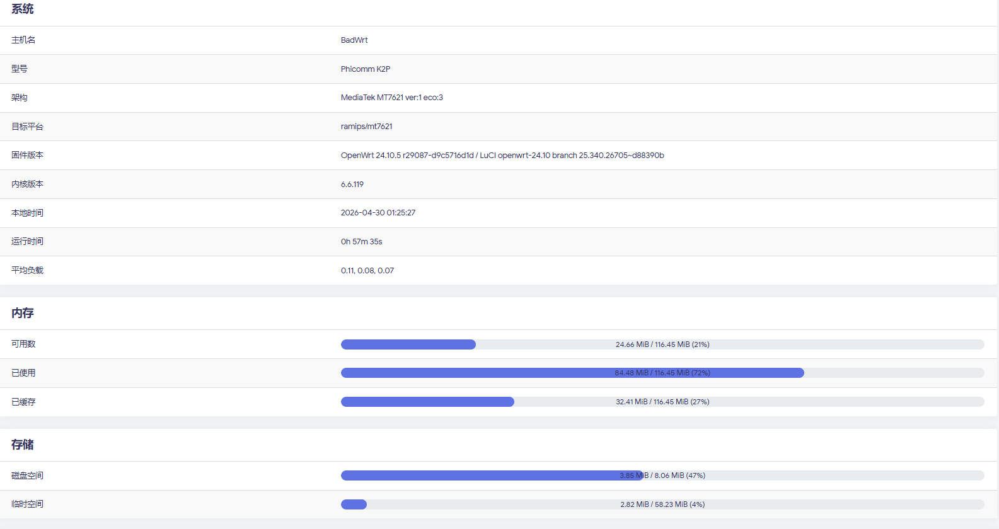

# ESurfingClient-C > [最新版本](https://github.com/BadGhost520/ESurfingClient-CVersion/releases/latest/)

**根据 Rsplwe 大佬的 Kotlin 源码编写的纯 C 版本的 `广东` 天翼校园认证客户端** 👍

**使用了 [cJSON](https://github.com/DaveGamble/cJSON), [mongoose](https://github.com/cesanta/mongoose) 开源库**

**优点是程序文件超级小 (所有版本均是仅占用 2MB 左右的储存空间😋), 并且跨平台跨架构能力超强**

**目前有支持 OpenWRT 15.05 到最新版的 LuCI 以及程序软件包**

> [!WARNING]
> 程序只负责在不同平台登录校园网
> 
> 不负责包括但不限于无视用户数限制登录等不合规操作

> [!NOTE]
> 理论上只要是用天翼校园网客户端的学校都可以用, 不论省份🤔
>
> 不过目前只在 `广东` 验证可行
>
> 正在努力修理各种奇怪 bug, 只能说尽量了
> 
> 现在正在做 Web 前端, 完成后可以更方便地管理程序

> [!TIP]
> 要是有人能一起维护这个项目, 那将是极好的😋

## 附上作者自用 K2P 路由器安装本包之后的资源占用情况⬇

  

> [!TIP]
> 经实测, 运行十天后运行内存占用仅增加 300 kB 左右
> 
> VmHWM: 3108 kB
> 
> VmRSS: 3048 kB
> 
> 4 级信息级日志文件轮换后占用 1000 kB 左右

# 主程序目前支持的系统和架构

|    系统     |         架构         | 包管理器 |      理论最低支持版本       |      推荐版本       |
|:---------:|:------------------:|:----:|:-------------------:|:---------------:|
|  Windows  |       x86_64       |  /   |   Windows XP SP3    |   Windows 10	   |
|   Linux   |       x86_64       |  /   |   Linux 内核 2.6.0    |  Linux 内核 4.14  |
|   macOS   |       x86_64       |  /   |      macOS 12       |    macOS 13     |
|   macOS   |       arm64        |  /   |      macOS 13       |    macOS 14     |
|  OpenWrt  |       x86_64       | opkg |    OpenWrt 15.05    | OpenWrt 19.07.0 |
|  OpenWrt  |       x86_64       | apk  | OpenWrt 25.12.0-rc1 | OpenWrt 25.12.0 |
|  OpenWrt  |   ramips_mt7621    | opkg |    OpenWrt 15.05    | OpenWrt 19.07.0 |
|  OpenWrt  |   ramips_mt7621    | apk  | OpenWrt 25.12.0-rc1 | OpenWrt 25.12.0 |
|  OpenWrt  | qualcommax_ipq60xx | opkg |    OpenWrt 15.05    | OpenWrt 19.07.0 |
|  OpenWrt  | qualcommax_ipq60xx | apk  | OpenWrt 25.12.0-rc1 | OpenWrt 25.12.0 |
|  OpenWrt  |  mediatek_filogic  | opkg |    OpenWrt 15.05    | OpenWrt 19.07.0 |
|  OpenWrt  |  mediatek_filogic  | apk  | OpenWrt 25.12.0-rc1 | OpenWrt 25.12.0 |

### OpenWRT LuCI 包

|   系统    | 架构  | 包管理器 |      理论最低支持版本       |      推荐版本       |
|:-------:|:---:|:----:|:-------------------:|:---------------:|
| OpenWrt | All | opkg |    OpenWrt 15.05    | OpenWrt 19.07.0 |
| OpenWrt | All | apk  | OpenWrt 25.12.0-rc1 | OpenWrt 25.12.0 |

> [!NOTE]
> 为什么在使用 opkg 管理器的版本里推荐 `19.07.0` 这个版本
> 
> 因为它是开始使用 LuCI2 的第一个版本

> [!TIP]
> 如果有其它兼容需求, 可以提交一个 issue, 会尝试进行兼容
> 
> 务必要在 issue 中提供系统和 cpu 型号, 架构等信息

# 使用教程

[**Windows, Linux, macOS 环境**](Desktop.md)

[**OpenWRT 环境**](OpenWRT.md)

[**OpenWRT 进阶 - 多播**](OpenWRT_mwan3.md)

[**自行编译指南**](Compile.md)

# 关于日志系统

### 在 Windows 系统中

- 程序运行后, 会在程序的运行目录下新建 logs 文件夹
- 程序运行时, logs 目录下会生成实时更新的 run.log 日志文件
- 程序退出时, run.log 日志文件会被重命名为 <时间>.log (比如 19700101-114514.log)
- 日志行数超过 10000 行会进行轮转操作 (虽然不大可能会有那么长)

### 在类 Unix 系统中

- 程序运行后, 会新建 /var/log/esurfing/logs 目录
- 程序运行时, logs 目录下会生成实时更新的 run.log 日志文件
- 程序退出时, run.log 日志文件会被重命名为 <时间>.log (比如 19700101-114514.log)
- 日志行数超过 10000 行会进行轮转操作 (虽然不大可能会有那么长)

# [更新日志](UpdateLogs.md)

> [!WARNING]
> 不要让我发现有人拿去做路由器贩卖喔

# 赞助 👍

觉得好的话可以点击这个[神秘小链接](https://ifdian.net/a/badghost)或者下边的微信赞赏码给偶打点钱喵, 谢谢泥喵~

# 赞助者 ❤

**感谢下面的赞助者支持👍**

### 爱发电

### 微信

